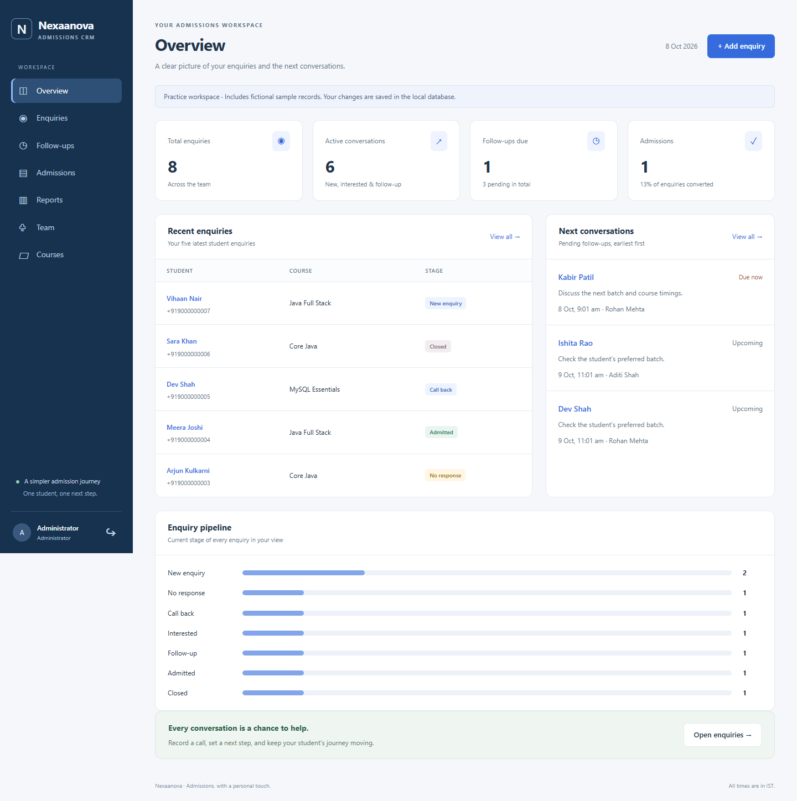

# Nexaanova — Task 3

A small Java admission CRM rebuilt from Tasks 1 and 2. Ordinary Java classes, Spring Boot, JDBC/DAO, MySQL, and plain HTML/CSS/JavaScript keep the code understandable for a student project.



See [improvements from the original work](docs/improvements.md) for the before-and-after comparison and verification.

## Run on this Windows computer

Open PowerShell in this folder:

```powershell
.\scripts\run-local.ps1
```

Open **http://127.0.0.1:8080**. Your generated practice passwords are in **.local/DEMO-ACCOUNTS.txt**, outside version control.

The helper uses the installed JDK 21 and MySQL Server 8.0. For other installations:

```powershell
.\scripts\run-local.ps1 -JavaHome 'C:\path\to\jdk' -MySqlHome 'C:\path\to\MySQL'
```

First run needs internet to download Maven and dependencies. The Maven wrapper is included; no separate Maven installation is required. Java 17+ is required.

Setup creates its own MySQL instance in `.local/mysql-dev`, on localhost port **3307**, and database `nexaanova_task3`. It leaves the existing service on 3306 alone. Fictional demo accounts, three courses, and eight enquiries are seeded only into an empty database. Restarting preserves records.

Stop before editing and rebuilding:

```powershell
.\scripts\stop-local.ps1
.\scripts\run-local.ps1
```

To stop the local database too: `.\scripts\stop-local.ps1 -Database`. The scripts check process ownership. Setup refuses to overwrite an earlier data directory.

## Try the workflow

1. Admin adds an enquiry and assigns a counselor.
2. That Counselor opens it, records a call, and schedules a future follow-up.
3. Mark the follow-up completed, then choose **Admit student**.
4. Confirm course/initial payment and open the printable receipt.
5. Reload or restart; saved records remain. Manager can review team data without editing it.

Implemented: login/logout, account activation, ownership checks, enquiries/assignment, call history, follow-ups, admission conversion, initial fee balance, print receipts, course/team administration, real counts, enquiry search/stage filtering, basic source/counselor reports.

Pending: CSV import/export, installments/payment ledger, date-range reports, password change/reset, and Trainer/Student portals.

## Edit without redesigning

| Change | File under src/main |
| --- | --- |
| Colors, spacing, responsive layout | `resources/static/assets/css/styles.css` |
| Page content and action forms | `resources/static/assets/js/app.js` |
| Shared formatting/forms/dialogs | `resources/static/assets/js/ui.js` |
| Requests and session tokens | `resources/static/assets/js/api.js` |
| Login | `resources/static/login.html`, `assets/js/login.js` |
| Print receipt | `resources/static/receipt.html`, `assets/js/receipt.js` |
| Stage/source/payment choices | `java/com/nexaanova/crm/util/CrmOptions.java` |
| Business rules | `java/com/nexaanova/crm/service/` |
| SQL queries | `java/com/nexaanova/crm/dao/` |
| Database tables | `resources/schema.sql` |

Read [architecture and edit guide](docs/architecture.md) before adding fields/stages. One shared layout serves all roles.

## Build and checks

```powershell
$env:JAVA_HOME = 'C:\Program Files\Java\jdk-21'
.\mvnw.cmd package
& "$env:JAVA_HOME\bin\java.exe" -cp 'target/test-classes;target/classes' com.nexaanova.crm.CoreChecks
```

`CoreChecks` is a Java main method with 17 checks. Maven compiles it; execute it explicitly with the command above. No JUnit/Mockito is included. [Acceptance cases](docs/manual-checks.md) describe the browser/API checks.

## Your own database

Create a dedicated database/application user. Copy `application-local.properties.example` to `.local/local.properties`, replace the credentials and initial Admin password (12–128 characters), then build/run:

```powershell
.\mvnw.cmd package
& "$env:JAVA_HOME\bin\java.exe" -Duser.timezone=Asia/Kolkata -jar target/admission-crm-1.0.0.jar
```

The automatic helpers assume the separate local instance and ports 3307/8080. Use manual startup for different ports. Schema initialization creates missing tables; it does not migrate changed columns.

## Syllabus and history

See [syllabus mapping](docs/architecture.md). Sessions/form tokens and standard Java PBKDF2 hashing are supporting details; password hashing is not explicitly named in the syllabus. No Spring Security, JWT, Lombok, JPA repositories, or optional frontend framework is used.

Tasks 1/2 and Current Workspace are preserved. The original Task 3 remains in Git history; the assisted workspace also keeps a verified private local ZIP/archive. That archive is not uploaded in this source update. [Selected dated progress and verification](../log%20of%20nexaa/README.md) are available in the repository; the full original audit remains in the workspace's log of nexaa folder.

This is a local practice version. Hosted deployment still needs HTTPS/secure cookies, backup/restore, login throttling, recovery, and operational testing.
